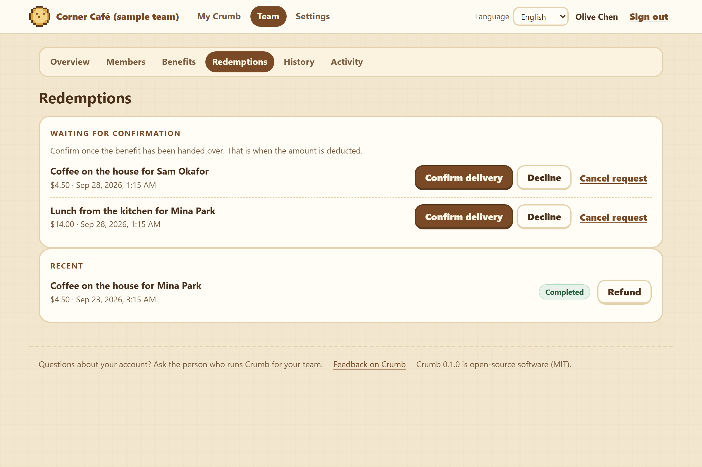

# Crumb


## Make appreciation something to keep.

Open-source recognition and rewards for teams. Self-hosted, with data under your control.

[Try the demo](https://bellaaaaxu.github.io/crumb/) · [Deploy Crumb](docs/DEPLOYMENT.md) · [Share feedback](https://github.com/bellaaaaxu/crumb/issues/new/choose)

Most thank-yous are gone the moment they are said. Crumb gives them somewhere to land.

A team lead sends **recognition**: a few words about what someone did, with a reward
alongside. The reward goes toward **real benefits** your team chooses — a coffee, a lunch,
a voucher. And each time someone's total recognition passes a step you set, a new **pixel
pastry** joins their shelf. Spending the reward never takes one away: the shelf counts
thanks received, not money held.

Crumb runs on your own server, for one organization, with its data in one file you back up
and control. No analytics, no email service, and the app itself sends nothing anywhere.

<br clear="right">

## A short story

*The team and people here are invented.*

**Thursday, 4:40 p.m.** The espresso machine floods an hour before close. Mina stays late,
mops up and gets the bar ready for the morning.

**Friday.** Olive, who runs the team, opens Crumb, chooses Mina, types $30 and writes:
*Stayed late to close when the espresso machine flooded. The morning crew walked into a
spotless bar.* Mina sees the message, the $30, and a new pastry on her shelf.

**The next week.** Mina asks for lunch from the kitchen. Crumb sets $14 aside. When lunch
is handed over, Olive confirms it and the $14 is deducted.

**Months later.** Her balance has gone up and down. Her shelf has only grown, and the
thank-you from that Thursday is still in her history.

## What each side sees

**Team members** get *My Crumb* (above): what they can spend and what is set aside, their
collection and what comes next, the benefits they can ask for, their requests and where each
one stands, and every message of thanks they have received. Each person sees only their own
account — there are no leaderboards and no comparisons.

**Team leads** — owners and admins — give recognition from the *Team* page:


…and confirm benefits once they have actually been handed over. That is when the amount is
deducted; declining or cancelling simply releases it.



They also invite people with one-time links, make a new sign-in link when someone changes
phones, deactivate accounts, keep the benefits catalog, correct mistakes (a revoke needs a reason and stays visible, marked
revoked), export the ledger and read the activity log. Owners set the name, logo, welcome
message, language and reward rules.

## Where it fits

Any team that wants thanks to add up to something — for example:

- **A café or bakery:** thank the person who closed alone on a snowy night; the reward
  becomes coffee or lunch on the house.
- **A shop:** recognise the busiest Saturday of the season; the reward becomes a store voucher.
- **An office team:** thank whoever unblocked a release; the reward becomes a book, a team
  lunch or event tickets.

These are examples of how it can be used, not a list of teams that use it.

## What is in version 0.1

- **Recognition** with a message and an amount, in **credit** (CAD, USD or CNY, exact to the
  cent) or whole **points** under a name you choose.
- **Benefits** your team defines. A request sets the amount aside; an admin confirms delivery
  or declines; members can cancel while it waits; a confirmed request can be refunded once.
- **A permanent collection** of 39 pixel pastries, unlocked by recognition received. Spending
  never removes one, and neither does correcting a mistaken reward.
- **Roles**: owner, admin and member. Team members sign in with a personal link — no
  password to remember — and their phone stays signed in for up to 180 days; a new link
  signs a lost phone out. Owners and admins use a password. Every link is shown to an admin
  with its QR code: the person scans it in person, or it is sent as a picture that a long
  press opens. Sign-in and invitation links last 7 days, password resets 30 minutes — Crumb
  sends no email.
- **Records that stay put**: an append-only ledger and activity log. A reward, request,
  confirmation or refund that is retried after a dropped connection is still recorded once,
  and two devices cannot spend the same balance.
- **Your brand and language**: organization name, logo and welcome message; English and
  Simplified Chinese, with each person free to choose.
- **Made for phones**, usable from the keyboard alone, with labelled controls and announced
  updates for screen readers, and no motion when people ask for less.
- **Operations**: consistent backups while running, restore into a new volume, owner
  recovery from the server, Docker Compose with automatic HTTPS through Caddy, and a
  spreadsheet-safe CSV export.

Crumb is deliberately **not** payroll or cash: rewards cannot be withdrawn or bought, it does
not do performance reviews, leaderboards or automatic rewards, and it is not a hosted service
— you run it.

## Try it

```bash
git clone https://github.com/bellaaaaxu/crumb.git
cd crumb
node scripts/init-secrets.mjs      # no Node? see the Docker-only command in docs/DEPLOYMENT.md
docker compose up -d --build
```

Open <http://localhost:3000>, paste the one-time setup code (`cat .secrets/setup-token`),
choose credit or points, and create the owner account.

To look around first, with Node.js 24 and no Docker: `npm ci`, then `npm run demo`. It opens
an invented team, "Corner Café (sample team)", at <http://localhost:3000> and prints the
owner's sign-in and a team member's sign-in link; everything is deleted when you stop it.

For your team you need a server with Docker and Docker Compose v2, about 1 GB of memory, and
a domain name so Crumb can run on HTTPS. [The deployment guide](docs/DEPLOYMENT.md) walks
through it; [the operations guide](docs/OPERATIONS.md) covers backups, restores, upgrades and
a locked-out owner. Crumb is free; hosting a server usually is not.

## Your data

Everything lives in one SQLite database on your server — people, password hashes, the
ledger, requests, collections, the activity log and your logo. Back it up with one command
while Crumb keeps running, and practise restoring it; the CSV export is for reading, not for
restoring. Crumb collects no analytics and sends nothing to anyone, including this project.
(With the HTTPS setup, the bundled Caddy proxy contacts Let's Encrypt for its certificate.)

Inside Crumb, *Contact your admin* leads to your organization's own page or address;
*Feedback on Crumb* leads here, unless an owner points it at their own form. The two never
stand in for each other.

## Status and limits

Crumb is **early — version 0.1**. The money rules, permissions, concurrency and recovery
are covered by automated tests, and [docs/VALIDATION.md](docs/VALIDATION.md) records exactly
what was tested, where, and what has not been verified yet. It has not had an independent
security audit.

One instance serves one organization. There is no email, no single sign-on, one collection
theme (the pastries), and it runs as a single server. Use it for a team's perks with regular
backups; do not use it for pay or anything tax-related.

## Contributing and feedback

Bug reports, usage stories and ideas are all welcome — [open an issue](https://github.com/bellaaaaxu/crumb/issues/new/choose)
(it needs a GitHub account; please use invented names, never real people's data). To change
code, docs, translations or pixel art, read [CONTRIBUTING.md](CONTRIBUTING.md); new
collectibles follow [docs/THEMES.md](docs/THEMES.md).

## The demo

[The demo](https://bellaaaaxu.github.io/crumb/) is a single static page: no server, no
sign-in, no dependencies, and it keeps its invented data in your browser. It plays a short
tour of the idea by itself; one touch hands you the controls. The self-hosted app in this
repository is the real thing, with accounts, roles, benefits and a shared ledger.

## The art

All 39 pastries live in the source as character grids, 12×12 each, in
[`assets/sprites.js`](assets/sprites.js) — no icon library, no pixel font, no image files.
The demo, the app and the link-preview card all draw from that one table.

```js
laopo: { palette: { X: '#5C3A1D', b: '#E0A73C', a: '#F3D488', s: '#8A5A22' }, rows: [
  '....XXXX....',
  '..XXbbbbXX..',
  ...
```

## How it is put together

Node.js 24 with Express and SQLite (better-sqlite3); sharp re-encodes uploaded logos and
draws the QR codes that uqr works out, on your own server. The
interface is plain HTML, CSS and ES modules — no framework and no build step. Tests use
Node's test runner and Playwright; deployment uses Docker Compose and Caddy.

```
server/     the API, the ledger and the rules, one module each
app/        the self-hosted interface, English and Simplified Chinese
themes/     the collectible set, generated from assets/sprites.js
scripts/    setup code, backup, restore, owner recovery, screenshots
tests/      unit, API, concurrency and browser tests
docs/       deployment, operations, themes and validation
index.html  the public demo (with assets/)
```

## Where it came from

Crumb began as an internal staff-credit tool for a bakery. This repository generalises it for
any team.

For that tool, I wrote the specifications and chose and reviewed what came back — including
the pixel art, which I directed and selected rather than placed cell by cell. I don't write the
code by hand. The judgment on display is in the data model, the permissions and the decisions
about what to show.

## License

Crumb is open source under the [MIT License](LICENSE). You may use, modify and deploy it,
including commercially, provided you keep the copyright and license notice.

Designed & built by **Bella Xu** · [github.com/bellaaaaxu](https://github.com/bellaaaaxu) ·
[中文说明](README.zh-CN.md)
