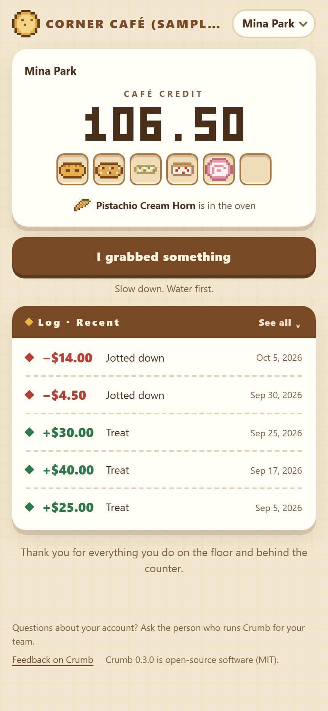
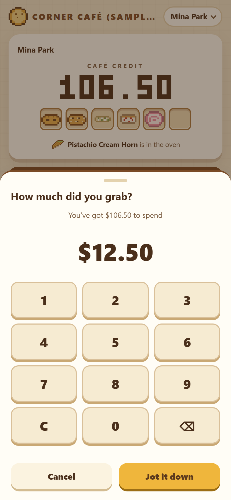
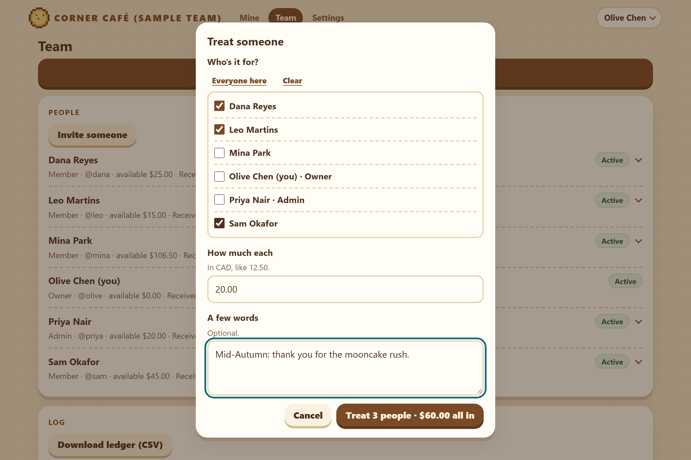

# Crumb



## 让感谢被留下来。

开源的团队认可与奖励工具。自行部署，数据由你掌握。

[体验演示](https://bellaaaaxu.github.io/crumb/) · [部署 Crumb](docs/DEPLOYMENT.md) · [提交反馈](https://github.com/bellaaaaxu/crumb/issues/new/choose)

大多数感谢，说完就没了。Crumb 给它们一个落脚的地方。

团队负责人**请下午茶**：给一个数额，愿意的话再写几句对方做了什么。这份下午茶可以换成团队
拿得出的**实际东西**——一杯咖啡、一顿午饭、一张礼券。成员收到的下午茶每攒过一个你设定的台阶，
收藏柜里就多一件**像素点心**。花掉不会拿走任何一件：收藏柜记的是收到的感谢，不是手里的余额。

Crumb 运行在你自己的服务器上，一个实例服务一个组织，数据就是一个由你备份和掌握的文件。
没有统计分析，不用邮件服务，应用本身不向任何地方发送数据。

<br clear="right">

## 一个小故事

*以下团队和人物都是虚构的。*

**周四下午 4:40。** 打烊前一小时，咖啡机漏水了。Mina 留下来拖地、收拾，把吧台准备好迎接第二天早班。

**周五。** 负责团队的 Olive 打开 Crumb，点“请下午茶”，勾上 Mina，输入 30 加元，写下：
*咖啡机漏水那晚你留下来收尾，早班进门看到的是一个干干净净的吧台。*
Mina 的余额往上滚了 30 加元，收藏柜里落下一件新出炉的点心，Olive 的话留在她的记录里。

**下一周。** Mina 从厨房拿了一份午餐，点“我拿了东西”，按了 14 加元，当场就从余额里扣掉了。

**几个月后。** 她的余额有涨有落，收藏柜却只增不减——那个周四的感谢，依然留在她的记录里。

## 两边各自看到什么

**团队成员**只有一页（右上图）：像素大数字显示能用多少；收藏柜里的点心，和正在烤箱里的下一件；
团队定下的花法；以及进出的记录——默认最近五条，展开后按月看全部。
每个人只看得到自己的账户——没有排行榜，也没有横向比较。

怎么花由团队决定。如果是大家自己记，就只有一个“我拿了东西”按钮和一个数字键盘，记下就当场扣：



如果要管理员确认，页面上就换成可以申请的福利和自己的申请。申请会先暂扣数额，管理员确认福利已经交到手上后才扣除；
拒绝或取消只会释放暂扣。

**团队负责人**（所有者和管理员）在“团队”页面请下午茶，可以请一个人，也可以一次请好几个人：



同一页列出团队里的人：点开某个人，就是对这个人的操作——一次性的邀请或登录链接（有人换手机时生成新的登录链接）、
更改角色、停用。下面是全团队的记录：请过的下午茶可以收回，自己记的一笔可以改一下，已确认的福利可以退回。
每次更正都要写原因，两条记录都保留，原来那条会做上标记。一次请好几个人，在记录里是一行，点开能看到每个人。
团队用“要确认”时，这一页还有等待处理的申请和福利清单，每项福利可以挑一件点心当图标。

所有者还有“设置”页：组织名称、标志、欢迎语、语言、奖励规则、大家怎么花、联系方式和反馈链接，以及操作日志“谁做了什么”。
管理员没有“设置”页，同一份操作日志在“团队”页最底下，只能看、不能改。
页头始终只有一行：右边的名字点开是一个菜单，里面有语言和退出登录，在手机上还有各个页面。

## 适合谁

任何希望感谢能积累下来的团队，例如：

- **咖啡店或面包店**：感谢雪夜独自打烊的同事，下午茶换成店里的咖啡或午饭。
- **零售门店**：旺季最忙的那个周六，一次请当班的所有人，下午茶换成店铺礼券。
- **办公室团队**：感谢帮大家解决卡点的同事，下午茶换成一本书、一顿团队午餐或活动门票。

以上是使用方式的例子，并不代表已有这些用户。

## 换成你自己的

Crumb 是给这样的小店准备的：下载下来，填几项设置，就能用起来——面包店、咖啡厅、奶茶店，
或者任何小团队。不用写代码。

剩下的交给设置：你们的名字和 logo、语言、额度叫什么（“Café credit”“星星”）、用额度还是积分、
币种、收藏主题（饼店或面包店）、攒多少出炉一件、一句欢迎语、大家怎么花（自己记一下，或者由管理员确认）、
联系链接和反馈链接。

想换一套收藏？加一套主题的做法在 [docs/THEMES.md](docs/THEMES.md)（英文）：在一个文件里画图、写清单，
跑一条命令，在测试里登记新键；愿意的话，再给它配上自己的说法。

为什么叫“Crumb”？面包吃完了，饼屑还在。额度花掉了，收藏柜里攒下的还在。

## 0.3 版包含什么

0.3 版新增：

- **收藏主题**：建团队时选一套，大家收藏柜里的图、吉祥物、浏览器标签和手机主屏图标，以及几句跟收藏有关的话，
  都跟着它走。自带两套：**饼店**（39 款点心，吉祥物是老婆饼）和**面包店**（24 款面包和蛋糕，吉祥物是咬一口吐司）。
  第一次请下午茶之前，所有者可以在设置里换；之后和解锁台阶一起定住。从 0.2 版升级上来的团队是饼店，收藏柜保持原样。
- **演示页面**可以在两套主题之间切换。

从 0.2 版升级，第一次启动时会更新一次数据库：请先备份，并阅读
[从 0.2 升级到 0.3](docs/OPERATIONS.md#upgrading-from-02-to-03)（英文）。从 0.1 版升级，还要读
[从 0.1 升级到 0.2](docs/OPERATIONS.md#upgrading-from-01-to-02)（英文）：0.3 第一次启动时两次更新一起完成。

0.2 版新增：

- **成员只有一页**，不用来回切换：能用多少、收藏柜和正在烤箱里的那一件、团队定下的花法，以及自己的记录。
  团队负责人在一个没有子页面的“团队”页上操作，所有者另有“设置”页；页头始终只有一行。
- **自己记**：拿了什么自己按键盘记下，当场扣。它和 0.1 版的福利申请并列，后者现在叫**要确认**；
  每个团队用其中一种，所有者随时可以改。初次设置时默认选自己记。
- **一次请好几个人下午茶**，每人同一数额，要么全记上，要么全不记；在记录里是一行。
- **更正自己记的一笔**：管理员改一下，要写原因；原来那条留在记录里，并做上标记。
- **福利图标**：福利可以挑一件点心当图标。
- **原版福利站的样子**，加上五个简短的动画；选了“减少动态效果”就没有动画。
- **新的叫法**：应用里统一叫“下午茶”，就是 0.1 版里的“认可”。

0.1 版就有、现在仍然有的：

- **请下午茶**：一个数额，留言可写可不写，单位是**福利额度**（加元、美元或人民币，精确到分）或**积分**
  （整数，名称自定）。
- **福利**由团队自己定义，团队用“要确认”时可以申请：数额先暂扣，管理员确认交付或拒绝，
  等待期间成员可以取消，已确认的申请可以退回一次。
- **更正也留在记录里**：管理员可以收回一次下午茶，或者退回一项福利，都要写原因；
  原来那条留在记录里，并做上标记。
- **永久收藏**：按累计收到的下午茶解锁，饼店主题是 39 款像素点心，面包店主题是 24 款面包和蛋糕。消费不会移除任何一件，更正误发也不会。
- **角色**：所有者、管理员、成员。成员用专属链接登录，不用记密码，手机最多保持登录 180 天；
  生成新链接会让丢失的手机立即退出。所有者和管理员用密码登录。每个链接都附带二维码：当面扫码，
  或者把二维码图片发给对方、在手机上长按识别。登录链接和邀请链接 7 天有效，密码重置链接
  30 分钟有效——Crumb 不发邮件。
- **记录不会被改写**：只追加的账本和操作日志。连接中断后重试的下午茶、记账、申请、确认或更正只会记录一次，
  两台设备也不能同时花掉同一笔余额。
- **你的品牌与语言**：组织名称、标志和欢迎语；英文和简体中文，每个人可以自己选择。
- **适配手机**，可以只用键盘完成操作，控件带有标签、更新会通知屏幕阅读器，并尊重“减少动态效果”设置。
- **运维**：运行中也能做一致的备份，恢复到新的数据卷，在服务器上找回所有者账户，
  Docker Compose 加 Caddy 自动 HTTPS，以及防公式注入的 CSV 导出。

Crumb 刻意**不做**工资或现金：下午茶不能提现也不能购买；不做绩效考核、排行榜或自动发奖；
也不是托管服务——由你自己运行。

## 试一试

```bash
git clone https://github.com/bellaaaaxu/crumb.git
cd crumb
node scripts/init-secrets.mjs      # 没有 Node？部署指南里有只用 Docker 的命令
docker compose up -d --build
```

打开 <http://localhost:3000>，粘贴一次性设置码（`cat .secrets/setup-token`），选择福利额度或积分、
大家怎么花，然后创建所有者账户。

想先看看、电脑上有 Node.js 24 而没有 Docker：先 `npm ci`，再 `npm run demo`。它会在
<http://localhost:3000> 打开一个虚构的英文示例团队「Corner Café (sample team)」，并显示所有者的登录方式和一位成员的登录链接；
停止后数据全部删除。示例团队是自己记账的；想看另一种花法，用所有者登录，在设置的
“How people spend”（大家怎么花）里选“Confirmed”（要确认）。

正式给团队使用，需要一台装有 Docker 和 Docker Compose v2 的服务器、约 1 GB 内存，
以及一个域名以便启用 HTTPS。具体步骤见[部署指南](docs/DEPLOYMENT.md)（英文）；
备份、恢复、升级和所有者找回见[运维指南](docs/OPERATIONS.md)（英文）。
Crumb 本身免费，但租用服务器通常需要付费。

## 你的数据

所有数据都在你服务器上的一个 SQLite 数据库里——成员、密码哈希、账本、申请、收藏、操作日志和标志。
Crumb 运行时一条命令即可备份，并请定期演练恢复；CSV 导出是给人看的，不能用来恢复。
Crumb 不收集统计数据，也不向任何人发送任何东西，包括本项目。（启用 HTTPS 时，随附的 Caddy 代理会连接 Let's Encrypt 申请证书。）

在 Crumb 里，“联系管理员”指向你们组织自己的页面或邮箱；“反馈 Crumb”默认指向本项目，所有者也可以改成自己的表单。两者互不替代。

## 现状与限制

Crumb 还处于**早期（0.3 版）**。金额规则、权限、并发和恢复都有自动化测试；
[docs/VALIDATION.md](docs/VALIDATION.md)（英文）如实记录了测过什么、在哪里测的，以及还没有验证的部分。
它尚未经过独立的安全审计。

一个实例只服务一个组织。没有邮件、没有单点登录，收藏主题只有两套可选（每个团队用一套），并以单台服务器运行。
可以用来管理团队福利，但请定期备份；不要用于工资或任何涉税用途。

## 参与和反馈

欢迎报告问题、分享使用经验和提出建议——[提交 issue](https://github.com/bellaaaaxu/crumb/issues/new/choose)
（需要 GitHub 账号；请使用虚构的名字，不要提交真实人员的资料）。修改代码、文档、翻译或像素画，
请先阅读 [CONTRIBUTING.md](CONTRIBUTING.md)（英文）；新增收藏品或主题请按 [docs/THEMES.md](docs/THEMES.md)（英文）。

## 关于演示

[演示页面](https://bellaaaaxu.github.io/crumb/)是一个静态网页：没有服务器、不用登录、没有依赖，
虚构数据只保存在你的浏览器里。它会自动播放一段介绍，点一下就由你接手。
本仓库里的自托管应用才是完整的产品：有账户、角色、福利和共享的账本。

## 关于像素画

饼店的 39 款点心和面包店的 24 款面包和蛋糕（两套共用 12 款，一共 51 张图），全部以 12×12 的字符网格写在源码
[`assets/sprites.js`](assets/sprites.js) 里——没有图标库、没有像素字体、没有图片文件。演示、应用和链接预览卡片都画自同一张表。

## 技术构成

Node.js 24 搭配 Express 和 SQLite（better-sqlite3）；上传的标志由 sharp 重新编码，
二维码由 uqr 算出、sharp 在你自己的服务器上画成图片。
界面是纯 HTML、CSS 和 ES 模块——没有框架，也不需要构建。测试使用 Node 自带的测试运行器和 Playwright；
部署使用 Docker Compose 和 Caddy。

## 由来

Crumb 最初是一家面包店的内部员工额度工具。本仓库把它推广给任何团队。

做那个工具时，我撰写需求规格、挑选和审阅产出——包括像素画，是我指导和挑选的，而不是逐格画出来的。
代码不是我手写的。这里体现的判断，在于数据模型、权限设计，以及决定给用户看什么。

## 许可

Crumb 以 [MIT 许可](LICENSE)开源。你可以使用、修改和部署它（包括商业用途），只需保留版权和许可声明。

由 **Bella Xu** 设计与构建 · [github.com/bellaaaaxu](https://github.com/bellaaaaxu) · [English](README.md)
